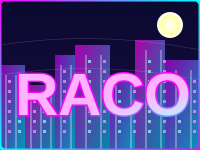

.. MCP Agent documentation master file, created by
   sphinx-quickstart on Thu Aug 17 09:30:44 2023.
   You can adapt this file completely to your liking, but it should at least
   contain the root `toctree` directive.

Welcome to RACO Agent's documentation!
======================================

.. toctree::
   :maxdepth: 2
   :caption: Contents:
   
.. toctree::
   :maxdepth: 2
   :caption: Technical Documentation
   
   requirements
   architecture

.. toctree::
   :maxdepth: 2
   :caption: API Reference

Overview
========

RACO (Ralf's AI Code Orchestrator) is an intelligent agent system designed to assist in application development through human-in-the-loop workflows and structured multi-step processes. Built on the MCP-agent-rs framework, RACO leverages the Model Context Protocol to provide a powerful, flexible system for both console and web-based interactions.

Key Features
===========

* **Human-in-the-Loop Development**: RACO enables collaborative development with AI assistance, combining the strengths of human intelligence and AI capabilities.
* **Structured Workflows**: Define concrete steps for task completion with clear criteria to track progress.
* **Multi-interface Support**: Use RACO through either console or web interfaces based on your preference.
* **MCP Integration**: Built on the robust MCP-agent-rs framework for reliable AI model interactions.
* **Rust Performance**: Implemented in Rust for speed, safety, and reliability.

Getting Started
==============

To get started with RACO, follow the installation instructions and check out the tutorials in the documentation.

Indices and tables
==================

* :ref:`genindex`
* :ref:`modindex`
* :ref:`search` 